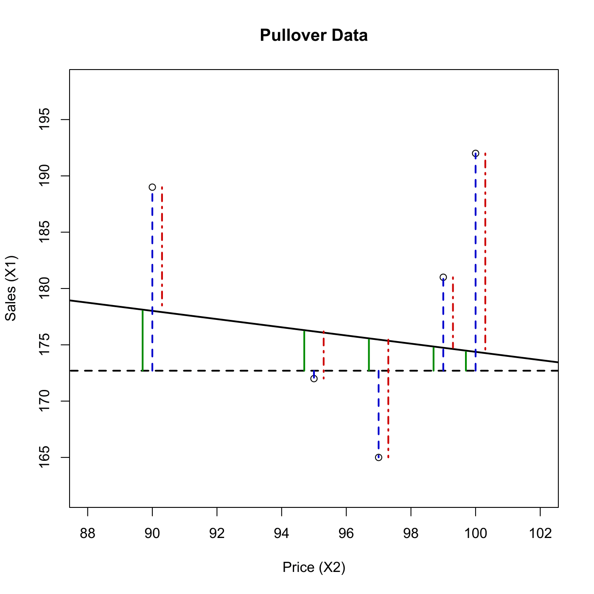

[](http://quantlet.de/index.php?p=info)

## [](http://quantlet.de/) **MVAregzoom** [](http://quantlet.de/d3/ia)

```yaml

Name of QuantLet : MVAregzoom

Published in : Applied Multivariate Statistical Analysis

Description : 'Plots a section of the linear regression of the sales (X1) on price (X2) for the
pullovers data. Graphical representation of the relationship: total variation = explained variation
+ unexplained variation.'

Keywords : 'data visualization, graphical representation, plot, linear-model, linear-regression,
regression, scatterplot'

See also : MVAregpull, MVAregbank

Author : Vladimir Georgescu, Jorge Patron, Song Song, Awdesch Melzer

Submitted : Mon, September 15 2014 by Awdesch Melzer

Datafiles : pullover.dat

```




```r

# clear variables and close windows
rm(list = ls(all = TRUE))
graphics.off()

# load data
x   = read.table("pullover.dat")
dat = cbind(x[, 2], x[, 1])
cv  = cov(dat)
sxy = cv[2, 1]
sxx = cv[1, 1]

beta = sxy/sxx

alpha = mean(dat[, 2]) - beta * mean(dat[, 1])

y = dat[, 2]

yhat = alpha + beta * dat[, 1]

yquer = NULL
steps = dim(x)[1]
for (i in 1:steps) {
    yquer[i] = mean(dat[, 2])
}

# Generating line1
line11 = NULL
line12 = NULL
m = 1
for (i in 1:steps) {
    line11[m] = dat[i, 1]
    line11[m + 1] = dat[i, 1]
    line11[m + 2] = dat[i, 1]
    m = m + 3
}

m = 1
for (i in 1:steps) {
    line12[m] = yquer[i]
    line12[m + 1] = y[i]
    line12[m + 2] = yhat[i]
    m = m + 3
}

line1 = cbind(line11, line12)

# Generating line2
line21 = NULL
line22 = NULL
m = 1

for (i in 1:steps) {
    line21[m] = dat[i, 1] - 0.3
    line21[m + 1] = dat[i, 1] - 0.3
    line21[m + 2] = dat[i, 1] - 0.3
    m = m + 3
}

m = 1
for (i in 1:steps) {
    line22[m] = yquer[i]
    line22[m + 1] = y[i]
    line22[m + 2] = yhat[i]
    m = m + 3
}

line2 = cbind(line21, line22)

# Generating line3

line31 = NULL
line32 = NULL

m = 1
for (i in 1:steps) {
    line31[m] = dat[i, 1] + 0.3
    line31[m + 1] = dat[i, 1] + 0.3
    line31[m + 2] = dat[i, 1] + 0.3
    m = m + 3
}

m = 1
for (i in 1:steps) {
    line32[m] = yquer[i]
    line32[m + 1] = y[i]
    line32[m + 2] = yhat[i]
    m = m + 3
}

line3 = cbind(line31, line32)

t = (round(min(dat[, 1])) - 5):(round(max(dat[, 1])) + 5)
fit = alpha + beta * t

rl = cbind(t, fit)

aux = mean(dat[, 2]) * matrix(1, length(t), length(t))
aux1 = aux[, 1]
ybar = cbind(t, aux1)

# Chart
plot(dat[, 1], dat[, 2], xlab = "Price (X2)", ylab = "Sales (X1)", xlim = c(88, 
    102), ylim = c(162, 198))
title("Pullover Data")
lines(rl[, 1], rl[, 2], lwd = 2)
lines(ybar[, 1], ybar[, 2], lty = "dashed", lwd = 2)

# Blueline
blueline = rbind(line1[1, ], line1[2, ], line1[4, ], line1[5, ], line1[7, ], line1[8, 
    ], line1[10, ], line1[11, ], line1[13, ], line1[14, ], line1[16, ], line1[17, 
    ], line1[19, ], line1[20, ], line1[22, ], line1[23, ], line1[25, ], line1[26, 
    ], line1[28, ], line1[29, ])

i = 1
s = dim(blueline)[1]
while (i < s) {
    lines(c(blueline[i, 1], blueline[i + 1, 1]), c(blueline[i, 2], blueline[i + 
        1, 2]), col = "blue3", lwd = 2, lty = "dashed")
    i = i + 2
}

# Greenline
greenline = rbind(line2[1, ], line2[3, ], line2[4, ], line2[6, ], line2[7, ], line2[9, 
    ], line2[10, ], line2[12, ], line2[13, ], line2[15, ], line2[16, ], line2[18, 
    ], line2[19, ], line2[21, ], line2[22, ], line2[24, ], line2[25, ], line2[27, 
    ], line2[28, ], line2[30, ])

i = 1
while (i < s) {
    lines(c(greenline[i, 1], greenline[i + 1, 1]), c(greenline[i, 2], greenline[i + 
        1, 2]), col = "green4", lwd = 2)
    i = i + 2
}

# Redline
redline = rbind(line3[1, ], line3[3, ], line3[5, ], line3[6, ], line3[7, ], line3[8, 
    ], line3[7, ], line3[9, ], line3[10, ], line3[12, ], line3[13, ], line3[15, 
    ], line3[17, ], line3[18, ], line3[19, ], line3[20, ], line3[23, ], line3[24, 
    ], line3[27, ], line3[26, ], line3[27, ], line3[28, ], line3[29, ], line3[30, 
    ])

i = 1
while (i < s) {
    lines(c(redline[i, 1], redline[i + 1, 1]), c(redline[i, 2], redline[i + 1, 
        2]), col = "red3", lwd = 2, lty = 4)
    i = i + 2
}

```
